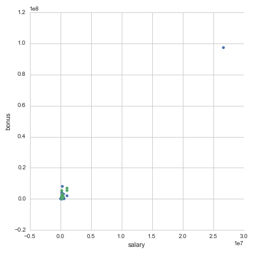
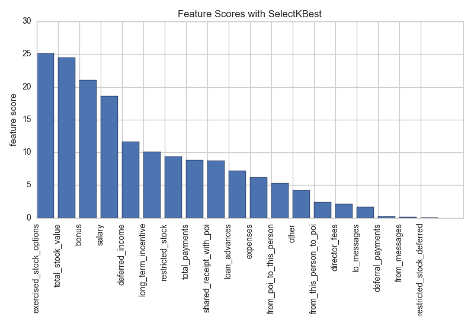

#Project 4 - Identify Fraud from Enron Email

###Question 1

**Summarize for us the goal of this project and how machine learning is useful in trying to accomplish it. As part of your answer, give some background on the dataset and how it can be used to answer the project question. Were there any outliers in the data when you got it, and how did you handle those?  [relevant rubric items: “data exploration”, “outlier investigation”]**

The goal of this project is to apply machine learning algorithms to build a prediction model that can classify the Person of Interest (POI) in [the 2001 Enron Scandal](https://en.wikipedia.org/wiki/Enron_scandal). 

**Data Exploration**. The dataset contains 146 total records with 21 features: 14 financial features, 6 email features, 1 label feature. There are 18 persons of interest (POI) and 128 non-POIs. 

**Outliers**. The dataset contains 1 extreme outlier on the top right which was identified when I plotted the scatter plot of salary vs bonus. A further investigation shows this outlier is due to the invalid input entry from the spreadsheet, i.e. “TOTAL”. I removed this outlier as it is not relevant for prediction. The outlier is removed by the code ```data_dict.pop('TOTAL')```



**Missing Values**. There are quite a few missing values in each features. A summary table of those missing values are as below. 

Feature | Valid | Missing Values
--- | :---: | :---:
bonus | 82 | 64
deferral\_payments | 39 | 107
deferred\_income | 49 | 97
director\_fees | 17 | 129
email\_address | 111 | 35
exercised\_stock\_options | 102 | 44
expenses | 95 | 51
from\_messages | 86 | 60
from\_poi\_to\_this\_person | 86 | 60
from\_this\_person\_to\_poi | 86 | 60
loan\_advances | 4 | 142
long\_term\_incentive | 66 | 80
other | 93 | 53
poi | 146 | 0
restricted\_stock | 110 | 36
restricted\_stock\_deferred | 18 | 128
salary | 95 | 51
shared\_receipt\_with\_poi | 86 | 60
to\_messages | 86 | 60
total\_payments | 125 | 21
total\_stock\_value | 126 | 20

###Question 2
**What features did you end up using in your POI identifier, and what selection process did you use to pick them?  Did you have to do any scaling?  Why or why not?  As part of the assignment, you should attempt to engineer your own feature that doesn’t come ready-made in the dataset--explain what feature you tried to make, and the rationale behind it.  (You do not necessarily have to use it in the final analysis, only engineer and test it.)  If you used an algorithm like a decision tree, please also give the feature importances of the features that you use.  [relevant rubric items: “create new features”, “properly scale features”, “intelligently select feature”]
What algorithm did you end up using? What other one(s) did you try? [relevant rubric item: “pick an algorithm”]**

**Feature Selection**. I used *SelectKBest* to fit the original data and obtained the scores of the features shown as the below graph. I chose the top 10 variables as the selected features. 



**Feature Scaling**. As the importances of the features selection process would be affected by the scale, e.g. salary vs number of emails, I used *MinMaxScaler* for scale the features during the feature selection process using *SelectKBest*. However, as the chosen algorithms do not require feature scaling, I didn't use feature scaling in the training and prediction process. The chosen algorithms are *DecisionTreeClassifier*, *RandomForestClassifier*, *LogisticRegression*, *SGDClassifier*. 

**Feature Engineering**. During the feature engineering process, I engineered two new features: total\_income (salary + bonus) and total\_assets (exercised\_stock\_options + total\_stock\_value). After I included the new engineered features, the precision and recall were improved using the final chosen algorithm. 

**Algorithms**. I ended up using *DecisionTreeClassifier* as the final algorithm because it gave the best f1 score which takes both precision and recall into consideration. I have attempted using *RandomForestClassifier*, *LogisticRegression*, *SGDClassifier* but found them underperforming (either both bad precision and recall or high precision but low recall). *LogisticRegression* achieved the highest f1 score (0.37156) but its recall is lower than 0.3, therefore, I didn't take it as the final algorithm. 

Algorithm | Precision | Recall | F1
--- | --- | --- | ---
[DecisionTreeClassifier][1] | 0.31587 | 0.31950 | 0.31767
[RandomForestClassifier][2] | 0.45652 | 0.17850 | 0.25665
[LogisticRegression][3] | 0.50472 | 0.29400 | 0.37156
[SGDClassifier][4] | 0.10858 | 0.21200 | 0.14361

[1]: http://scikit-learn.org/stable/modules/generated/sklearn.tree.DecisionTreeClassifier.html#sklearn.tree.DecisionTreeClassifier
[2]: http://scikit-learn.org/stable/modules/generated/sklearn.ensemble.RandomForestClassifier.html
[3]: http://scikit-learn.org/stable/modules/generated/sklearn.linear_model.LogisticRegression.html
[4]: http://scikit-learn.org/stable/modules/generated/sklearn.linear_model.SGDClassifier.html

For *DecisionTreeClassifier*, the feature importances are as below. 

Feature | Importance
--- | ---
exercised\_stock\_options | 0.3293
total\_income | 0.1467
total\_stock\_value | 0.1462
from\_poi\_to\_this\_person | 0.1019
bonus | 0.0741
from\_to\_poi | 0.0687
shared\_receipt\_with\_poi | 0.0686
total\_payments | 0.0645
salary | 0.0000
deferred\_income | 0.0000
long\_term\_incentive | 0.0000
restricted\_stock | 0.0000
loan\_advances | 0.0000

According to the table, it shows that the exercised\_stock\_options has the most importance while salary, deferred\_income, long\_term\_incentive, restricted\_stock and loan\_advances have no importance. 

###Question 3
**What does it mean to tune the parameters of an algorithm, and what can happen if you don’t do this well?  How did you tune the parameters of your particular algorithm?  (Some algorithms don’t have parameters that you need to tune--if this is the case for the one you picked, identify and briefly explain how you would have done it if you used, say, a decision tree classifier). [relevant rubric item: “tune the algorithm”]**

The parameters tuning is a process of finding the most optimum parameters to fit machine learning algorithms in order to achieve the best performances. Lack of this process may result in non-optimum performances such as accuracy, precision or recall. 

I used the *GridSearch* to optimise the parameters for the best f1 score, which is the harmonic mean of precision and recall. I used f1 score, the harmonic mean of precision and recall, because both precision and recall need to be above 0.3. 

###Question 4
**What is validation, and what’s a classic mistake you can make if you do it wrong?  How did you validate your analysis?  [relevant rubric item: “validation strategy”]
Give at least 2 evaluation metrics, and your average performance for each of them.  Explain an interpretation of your metrics that says something human-understandable about your algorithm’s performance. [relevant rubric item: “usage of evaluation metrics”]**

Validation is the process of evaluating the performance of tuned classifiers against the evaluation metrics selected. A classic mistake is that the classifier might be overfitted if this process is done in a wrong way, e.g. training data size is too large. The overfitting will result in the overperforming of training data but poor performance of the test data. 

I used *StratifiedShuffleSplit* to split the training and test data into 1000 folds and , which returns stratified randomised folds and randomly split each fold into training and test dataset. 

I used precision and recall to evaluate the classifiers. Precision, by definition, is the number of true positives divided by the number of the predicted positives, i.e. TP / (TP + NP). Recall, is defined as the number of true positives divided by the number of the actual positives, i.e. TP / (TP + FN). 

